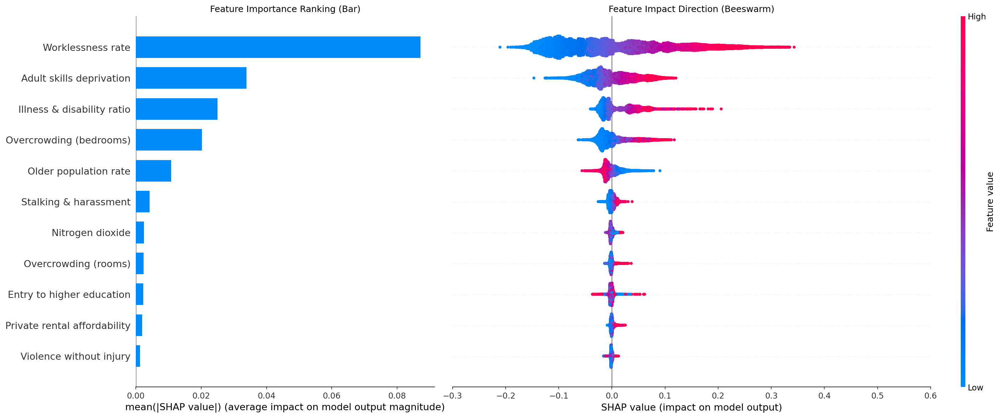
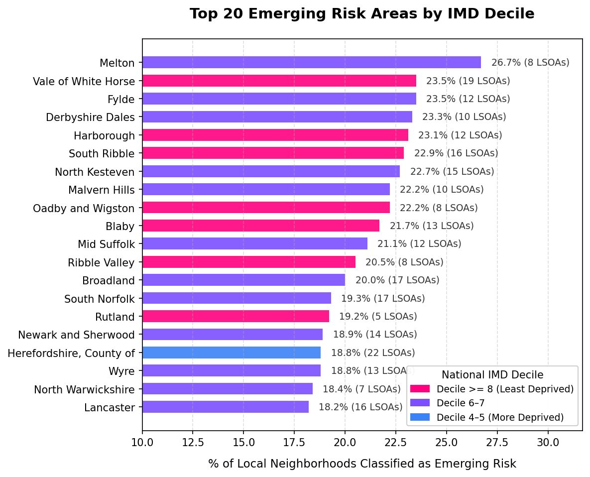
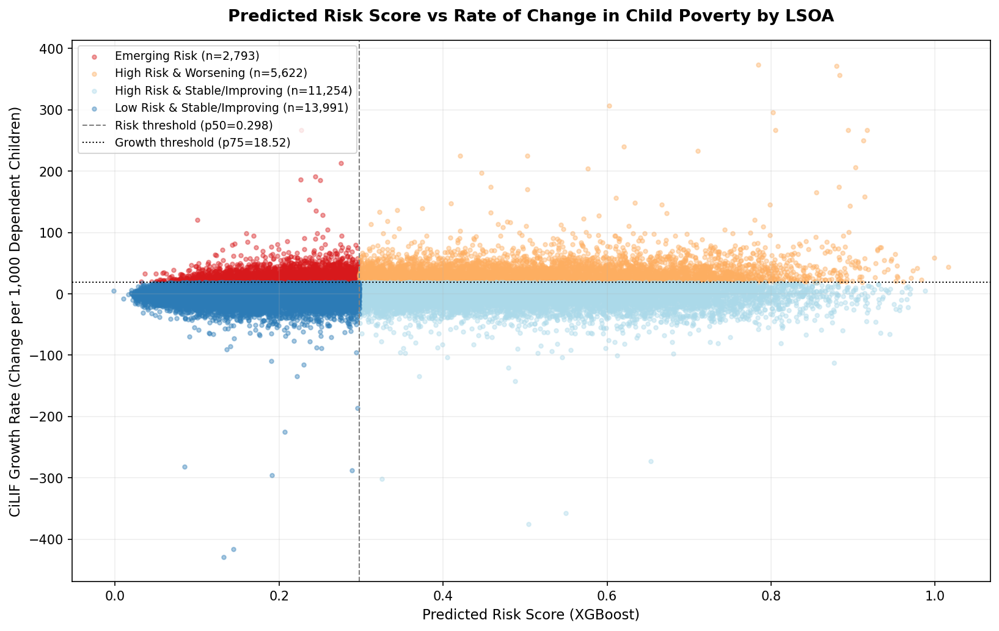
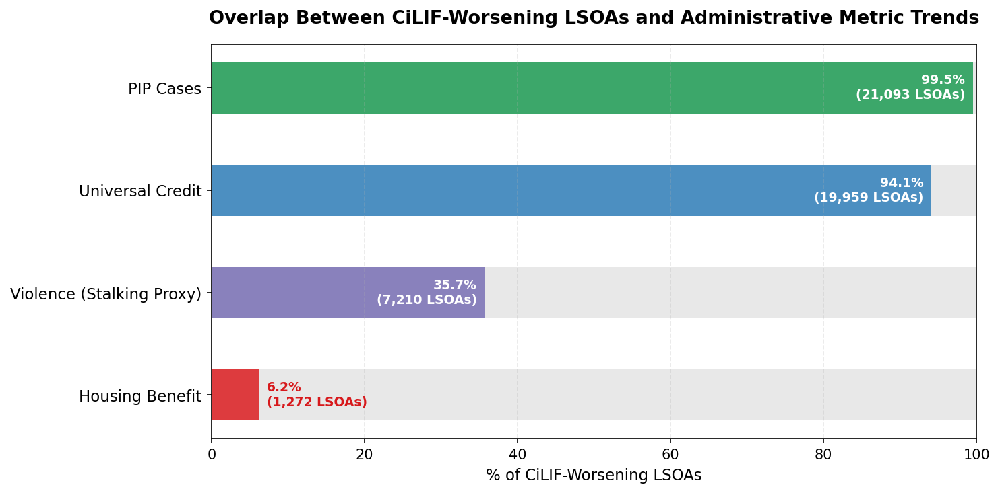

# Child Poverty Risk Scoring — England LSOAs

Predicting child poverty risk across all 33,755 Lower Super Output Areas (LSOAs) in England using machine learning, SHAP interpretability, and longitudinal trend analysis.

---

## Overview

Child poverty in England is not evenly distributed. It clusters in specific neighbourhoods, driven by combinations of socioeconomic, health, housing, and safety conditions that aggregate statistics rarely capture.

This project builds an XGBoost model to predict child poverty risk at neighbourhood level, identify where that risk is highest, uncover hidden pockets that official deprivation rankings miss, and track where conditions are actively getting worse.

---

## Research Questions

**Q1 — What drives child poverty risk?**
SHAP global interpretability reveals which IMD indicators most strongly predict IDACI scores and in which direction.

**Q2 — Which LSOAs have the highest predicted child poverty risk?**
Ranking all 33,755 neighbourhoods by predicted risk score.

**Q3 — Which local authorities contain the highest concentration of hidden risk areas?**
Identifying LSOAs with elevated predicted risk located within authorities that appear moderate in overall deprivation rankings.

**Q4 — Which areas show a worsening trend, and do the model's key drivers align with observed deterioration?**
Trend analysis using CiLIF data (2021/22–2024/25), with administrative validation against UC, PIP, Housing Benefit, and police crime records.

---

## Data Sources

| Dataset | Source | Coverage |
|---|---|---|
| Index of Multiple Deprivation 2025 (IMD) | [gov.uk](https://www.gov.uk/government/statistics/english-indices-of-deprivation-2025) | All 33,755 English LSOAs |
| Children in Low-Income Families (CiLIF) BHC Relative Low Income | [DWP Stat-Xplore](https://stat-xplore.dwp.gov.uk/) | 2021/22–2024/25, Output Area level |
| Universal Credit Claimants | DWP Stat-Xplore | 2021–2025, LSOA level |
| PIP Cases with Entitlement | DWP Stat-Xplore | 2021–2025, LSOA level |
| Housing Benefit Claimants | DWP Stat-Xplore | 2021–2025, LSOA level |
| Police-Recorded Street Crime | data.police.uk | 2021–2026, all 43 forces |

> Data files are not included in this repository due to size. All datasets are publicly available from the sources listed above.

---

## Methods

- **Target variable:** IDACI Score (Income Deprivation Affecting Children Index) from IMD 2025
- **Model:** XGBoost Regressor trained on IMD underlying indicators
- **Leakage prevention:** Spatial train-test split using `GroupShuffleSplit` by Local Authority (no LA appears in both train and test sets)
- **Hyperparameter tuning:** Optuna Bayesian optimisation, 50 trials, 3-fold spatial CV — best CV R² = **0.8628**
- **Interpretability:** SHAP TreeExplainer with percentile-based threshold selection (q=0.70) for feature filtering
- **Trend analysis:** Linear slope fitting (per 1,000 dependent children) across CiLIF years; forward projection to 2025/26
- **Caching:** Optuna study persisted via `joblib` (`optuna_study.pkl`) to avoid rerunning tuning

---

## Key Findings

**Q1 — Worklessness** is the dominant driver of child poverty risk, with an influence substantially greater than any other single factor. Low educational attainment, illness and disability, household overcrowding, and neighbourhood safety conditions are the next strongest contributors.



**Q2 —** The highest-risk neighbourhoods are concentrated in urban authorities including Hackney, Westminster, Blackpool, and Middlesbrough (all IMD decile 1).

**Q3 —** Authorities such as Harrow and Wandsworth — which rank as moderately deprived overall — contain significant numbers of LSOAs with elevated predicted child poverty risk. These hidden-risk pockets would be missed by deprivation-targeted funding criteria.

**Q4 —** Over 60% of LSOAs experienced worsening child poverty trends between 2021/22 and 2024/25. Nearly 2,800 areas were classified as **Emerging Risk**. Deterioration was disproportionately concentrated in rural and semi-rural districts (e.g. Melton, Vale of White Horse, Fylde) — outside the traditional deprivation hotspots that attract policy attention.





Administrative validation confirmed that 99.5% of worsening CiLIF areas also show rising PIP claims and 94.1% show rising UC claims, independently corroborating the model's identification of worklessness and health barriers as the primary drivers.



---

## Repository Structure

```
├── Child.ipynb              # Main analysis notebook (Q1–Q4)
├── optuna_study.pkl         # Cached Optuna tuning results
├── SHAP.png                 # SHAP bar + beeswarm plots (Q1)
├── beeswarm.png             # SHAP beeswarm (Q1)
├── q4_national_trend.png    # National CiLIF trend (Q4)
├── q4_scatter_risk_vs_slope.png  # Risk vs slope scatter (Q4)
├── q4_slope_correlations.png     # CiLIF vs admin feature slopes (Q4)
├── q4_overlap_analysis.png       # CiLIF worsening overlap chart (Q4)
├── q4_top20_emerging_risk_las.png # Top 20 emerging risk LAs (Q4)
└── .gitignore
```

---

## Requirements

```
pandas
numpy
matplotlib
scipy
scikit-learn
xgboost
shap
optuna
joblib
```

---

## Author

**Amira Shlebik**
[GitHub](https://github.com/Amira-Ali)
